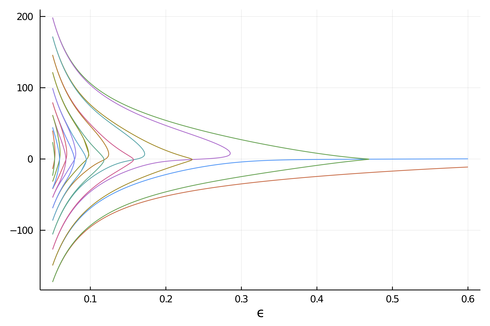

# Deflated Continuation


```@contents
Pages = ["DeflatedContinuation.md"]
Depth = 3
```

!!! unknown "References"
    Farrell, Patrick E., Casper H. L. Beentjes, and Ásgeir Birkisson. **The Computation of Disconnected Bifurcation Diagrams.** ArXiv:1603.00809 [Math], March 2, 2016. http://arxiv.org/abs/1603.00809.

Deflated continuation allows to compute branches of solutions to the equation $F(x,p)=0$. It is based on the Deflated Newton (see [Deflated problems](@ref)) algorithm.

See [`DefCont`](@ref) for more information.

However, unlike the regular continuation method, deflated continuation allows to compute **disconnected** bifurcation diagrams, something that is impossible for our [Automatic Bifurcation diagram computation](@ref) which is limited to the connected component of the initial point.

You can find an example of use of the method in [Carrier Problem](@ref carrier). We reproduce below the result of the computation which shows various disconnected components arising from Fold bifurcations that are found seemingly by the method.



## The deflation operator

The deflated continuation is built on the idea of *deflating* the solutions that have already been found: given known solutions $u^\star_1,\cdots,u^\star_{n}$, one replaces the functional $F$ by the *deflated* functional

$$G(u;\{u^\star_i\}_i) = F(u)\cdot \prod_{i=1}^n\left(\|u - u^\star_i\|^{-2p} + \alpha\right),$$

where $\|u - u^\star_i\|$ is a norm, $p$ a (positive) power and $\alpha>0$ a shift. The zeros of $G$ away from the $u^\star_i$'s coincide with those of $F$ but the Newton iterations for $G$ are penalized in the neighborhood of the already found solutions $u^\star_i$, hence the name. This product of deflations is implemented in the composite type [`DeflationOperator`](@ref); see [Deflated problems](@ref) for its API.

The deflated continuation algorithm then computes, at each value of the parameter, all the solutions which are *connected* to the ones found at the previous parameter value, together with the solutions lying on **disconnected** branches which are discovered by starting Newton iterations from perturbed initial guesses. Let us detail this now.

## Algorithm

```julia
Input: Initial parameter value λmin.
Input: Final parameter value λmax > λmin. Input: Step size ∆λ > 0.
Input: Nonlinear residual f(u,λ).
Input: Deflation operator M(u; u∗).
Input: Initial solutions S(λmin) to f(·,λmin).
λ ← λmin
while λ < λmax do
	F(·) ← f(·,λ+∆λ)                        # Fix the value of λ to solve for.
	S(λ+∆λ) ← ∅
	for u0 ∈ S(λ) do                         # Continue known branches.
		apply Newton’s method to F from initial guess u0.
		if solution u∗ found then
			S(λ + ∆λ) ← S(λ + ∆λ) ∪ {u∗}     # Record success.
			F(·) ← M(·;u∗)F(·)               # Deflate solution.
		end
	end
	for u0 ∈ S(λ) do                         # Seek new (disconnected) branches.
		success ← true
		while success do
			apply Newton’s method to F from initial guess u0.
			if solution u∗ found then         # New branch found.
				S(λ + ∆λ) ← S(λ + ∆λ) ∪ {u∗} # Record success.
				F(·) ← M(·;u∗)F(·)           # Deflate solution.
			else
				success ← false
			end
		end
	end
	λ←λ+∆λ
end
return S
```

!!! note "Inner loop"
    The outer loop over `u0 ∈ S(λ)` (second `for`) allows to find **several** disconnected branches. In `DefCont`, the number of Newton iterations spent searching for new branches is bounded: the maximal number of deflations performed at a given parameter value is `max_iter_defop * NewtonPar.max_iterations` (default `max_iter_defop = 5`). This is important because, without this bound, a single parameter value with many solutions could stall the computation.


## Tips

The following piece of information is valuable in order to get the algorithm working in various conditions (see also [here](https://github.com/bifurcationkit/BifurcationKit.jl/issues/33)) especially for small systems (e.g. dim<20):

- `newton` is quite good and it is convenient to limit it otherwise it will be able to bypass the deflation. For example, you can use `max_iterations = 10` in `NewtonPar`
- try to limit the newton residual by using the argument `callback_newton = BifurcationKit.cbMaxNorm(1e7)`. This will likely remove the occurrence of `┌ Error: Same solution found for identical parameter value!!`
- finally, you can try some aggressive shift (here `0.01` in the deflation operator, like `DeflationOperator(2, dot, 0.01, [sol])` but use it wisely.

## Basic example

We show a quick and simple example of use. Note in particular that the algorithm is able to find the disconnected branch. The starting points are marked with crosses

```@example DEFCONT
using BifurcationKit, LinearAlgebra, Plots
const BK = BifurcationKit

k = 2
N = 1
F(x, p) = @. p * x + x^(k+1)/(k+1) + 0.01
Jac_m(x, p) = diagm(0 => p .+ x.^k)

# bifurcation problem
prob = ODEBifProblem(F, [0.], 0.5, (@optic _), J = Jac_m)

# continuation options
opts = BK.ContinuationPar(ds=0.001, max_steps = 140, newton_options = NewtonPar(tol = 1e-8))

# algorithm
alg = DefCont(deflation_operator = DeflationOperator(2, .001, [[0.]]), perturb_solution = (x,p,id) -> (x  .+ 0.1 .* rand(length(x))))

brdc = continuation(prob, alg,
	ContinuationPar(opts, ds = -0.001, max_steps = 800, newton_options = NewtonPar(verbose = false, max_iterations = 6), plot_every_step = 40),
	; 
	plot=false,
	callback_newton = BK.cbMaxNorm(1e3) # reject newton step if residual too large
	)
plot(brdc)
```
