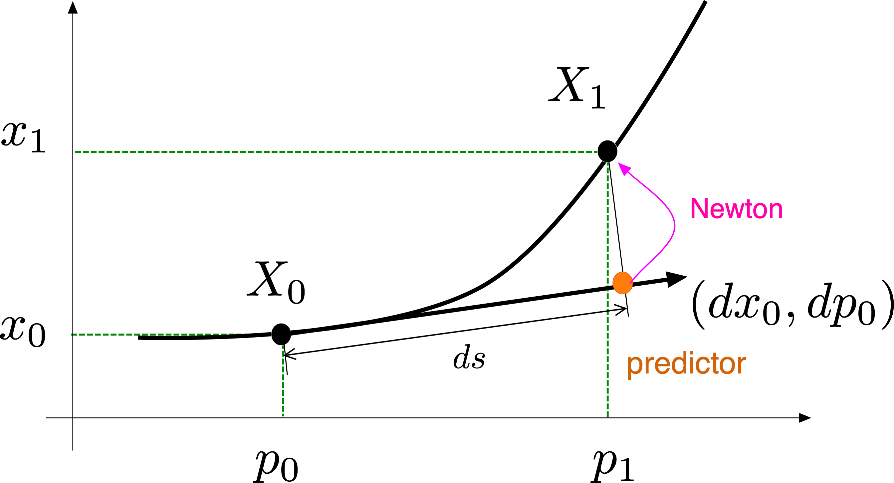
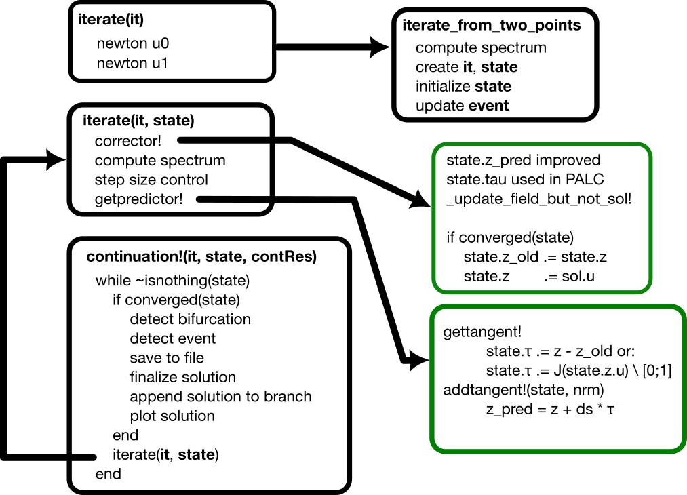

# Pseudo arclength  continuation

```@contents
Pages = ["PALC.md"]
Depth = 3
```

This is one of the continuation methods implemented in the package. It is set by the option `PALC(tangent = Secant())` (the default) or `PALC(tangent = Bordered())` in [`continuation`](@ref). See also [`PALC`](@ref) for more information.

For solving

$$\mathbb R^n\ni F(x,p) = 0 \quad\tag{E}$$

using a Newton algorithm, we miss an equation. The simplest way is to select an hyperplane in the space $\mathbb R^n\times \mathbb R$ passing through $(x_0,p_0)$:

$$N(x, p) := \frac{\theta}{n} \langle x - x_0, dx_0\rangle + (1 - \theta)\cdot(p - p_0)\cdot dp_0 - ds = 0\tag{N}$$

with $\theta\in[0,1]$ and where $ds$ is the pseudo arclength (see [^Keller]).

!!! warning "Parameter `θ`"
    The parameter `θ` is a field of the algorithm `PALC` (default `θ = 0.5`) and **not** of `ContinuationPar`. It is very important and should be tuned for continuation to work properly especially in the case of large problems where the ``\langle x - x_0, dx_0\rangle`` component in the constraint might be favored too much. Indeed, the term ``1-\theta`` multiplies ``p`` so that large `θ`s favour a parametrization by `p` while small `θ`s favour a parametrization by `x`.




## Predictor

The possible predictors are listed in [Predictors - Correctors](@ref).

## Corrector

The corrector is the newton algorithm for finding the roots $(x,p)$ of

$$\begin{bmatrix} F(x,p) \\	N(x,p)\end{bmatrix} = 0\tag{PALC}$$

## Linear Algebra


### Norm

First, the option `normC` of [`continuation`](@ref) specifies the norm used to evaluate the residual of the corrector in the following way:

$$max(normC(F(x,p)), |N(x,p)|)<tol.$$

It is thus used as a stopping criterion for the corrector. The dot product (resp. norm) used in the constraint $N$ and in the (iterative) linear solvers is **not** `LinearAlgebra.dot` (resp. `LinearAlgebra.norm`) but a normalized version thereof which is saved in the field `dotθ` of `PALC` (see below). Note that by default, the ``\mathcal L^2`` norm is used.

These details are important because the constraint $N$ incorporates the factor `1/length(x)` through the dot product. For some custom type implementing a Vector space, the dot product could already incorporate this factor in which case you should either provide a custom dot product or change $\theta$.


### Dot product

In the constraint $N$ above, the scalar product is implemented by `BifurcationKit.DotTheta`. By default, `PALC(dotθ = BifurcationKit.DotTheta())` uses the normalized dot product $\langle x,y\rangle \mapsto \frac{\langle x,y\rangle}{\mathtt{length}(x)}$. If you want to use your own dot product, you can build an algorithm

```julia
alg = PALC(dotθ = BifurcationKit.DotTheta(mydot, myapply!))
```

and pass it to [`continuation`](@ref). The second argument `myapply!` is a linear operator `P` (an inplace function) such that `mydot(x, y) = dot(x, P * y)`. It is required by the bordered linear solvers which need to evaluate the adjoint of `mydot`, e.g. `MatrixBLS`. We refer to [`BifurcationKit.DotTheta`](@ref) for more details. Passing a custom dot product is convenient, for example, when a Finite Element (mass) dot product is available, when the dimension of the state space changes during continuation (mesh adaptation), or to remove the factor `1/length(x)`.

### Linear problem

Pseudo arclength continuation is based on a newton solver applied to the enlarged problem (PALC). We thus need to solve a linear system of size $n+1$ whereas the user passed a linear solver (in `ContinuationPar().newton_options`) for a system of size $n$.

The linear solver for the linear problem associated to (PALC) is set by the field `bls` of `PALC` (default `MatrixBLS()`): it is one of [Bordered linear solvers (BLS)](@ref). One can also override it when calling [`continuation`](@ref) through the option `linear_algo`, but the recommended way is to set it in the algorithm, e.g.

```julia
alg = PALC(tangent = Secant(), bls = BorderingBLS(solver = DefaultLS()))
```


## Step size control

Each time the corrector fails, the step size ``ds`` is halved. This has the disadvantage of having lost Newton iterations (which costs time) and imposing small steps (which can be slow as well). To prevent this, the step size is controlled internally with the idea of having a constant number of Newton iterations per point. This is in part controlled by the aggressiveness factor `a` in `ContinuationPar`.

## Flow chart



## References

[^Keller]:> Keller, Herbert B. Lectures on Numerical Methods in Bifurcation Problems. Springer, 1988
