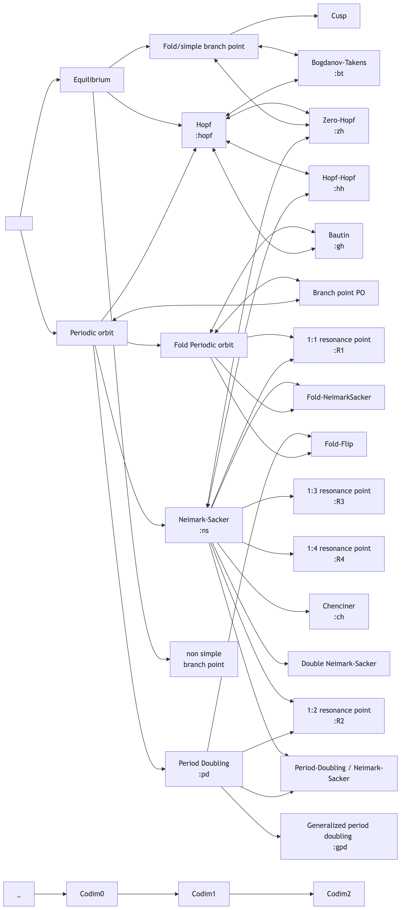

# Overview of capabilities

```@contents
Pages = ["capabilities.md"]
Depth = 3
```

## Main features

- Newton-Krylov solver with generic linear / eigen *preconditioned* solver. Idem for the arc-length continuation.
- Newton-Krylov solver with nonlinear deflation and preconditioner. It can be used for branch switching for example. It is used for deflated continuation.
- Continuation written as an [Iterator Interface](@ref).
- Monitoring user functions along curves computed by continuation, see [Event Handling](@ref).
- Continuation methods: PALC, Moore Penrose, Multiple, Polynomial, Deflated continuation, ANM, ...
- Bifurcation points / events located with bisection.
- Compatible with GPU

## Capabilities related to equilibria
- Detection of Branch, Fold, Hopf bifurcation points of stationary solutions and computation of their normal form. Other non-generic bifurcations based on spectrum are also detected.
- Automatic branch switching at branch points (**whatever the dimension of the kernel**) to equilibria
- **Automatic computation of bifurcation diagrams of equilibria**
- Fold / Hopf continuation based on Minimally Augmented formulation, with Matrix Free / Sparse / Dense Jacobian.
- Detection of all codim 2 bifurcations of equilibria and computation of the normal forms of Bogdanov-Takens, Bautin, Cusp, Zero-Hopf and Hopf-Hopf.
- Branching from Bogdanov-Takens / Zero-Hopf / Hopf-Hopf points to Fold / Hopf curve

## (limited) Capabilities related to maps
- continuation of fixed points of maps
- computation of normal form of Period-doubling, Neimark-Sacker, Branch point bifurcations.

## Summary table for equilibria

**Note that you can combine most solvers, like use Deflation for Periodic orbit computation or Fold of periodic orbits family.**

> Custom state means, you can use something else than `AbstractArray`, for example your own `struct`.

|Features|Matrix Free|Custom state| [Tutorial](@ref Tutorials) | GPU |
|---|---|---|---|---|
| (Deflated) Krylov-Newton| Yes| Yes| [Deflated problems](@ref)| Yes|
| Continuation PALC (Natural, Secant, Tangent, Polynomial) | Yes| Yes |All  | Yes |
| Deflated Continuation | Yes| Yes| [Deflated continuation in the Carrier problem](@ref carrier)|Yes  |
| Bifurcation / Fold / Hopf point detection | Yes| Yes| All | Yes |
| Fold Point continuation | Yes| Yes| [Temperature model (codim 2)](@ref temperature), [2d Ginzburg-Landau equation (finite differences, codim 2, Hopf aBS)](@ref cgl), [Extended Lorenz-84 model (codim 2 + BT/ZH aBS)](@ref lorenz) | Yes |
| Hopf Point continuation | Yes| `AbstractArray` | [Extended Lorenz-84 model (codim 2 + BT/ZH aBS)](@ref lorenz) ||
| Branch point / Fold / Hopf normal form | Yes| Yes| [1d Brusselator (automatic)](@ref brusauto) | |
| Branch switching at Branch points | Yes| `AbstractArray` | [From simple branch point to equilibria](@ref abs-simple-eq) | Yes |
| **Automatic bifurcation diagram computation of equilibria** | Yes| `AbstractArray` |  [pp2 example from AUTO07p (aBD + Hopf aBS)](@ref pp2) | |
| Bogdanov-Takens / Bautin / Cusp / Zero-Hopf / Hopf-Hopf point detection | Yes| Yes | [Extended Lorenz-84 model (codim 2 + BT/ZH aBS)](@ref lorenz) | |
| Bogdanov-Takens / Bautin / Cusp normal forms | Yes| `AbstractArray`| [Extended Lorenz-84 model (codim 2 + BT/ZH aBS)](@ref lorenz)| Yes |
| Branching from Bogdanov-Takens / Zero-Hopf / Hopf-Hopf to Fold / Hopf curve | Yes | `AbstractArray` | [Extended Lorenz-84 model (codim 2 + BT/ZH aBS)](@ref lorenz)|  |


## Capabilities related to Periodic orbits (PO)

- PO computation and continuation using **parallel** (Standard or Poincaré) Shooting, Finite Differences or Orthogonal Collocation (mesh adaptive).
- Automatic branch switching from simple Hopf points to PO
- Automatic branch switching from simple Period-Doubling points to PO
- Assisted branch switching from simple Branch points to PO
- Detection of Branch, Fold, Neimark-Sacker (NS), Period Doubling (PD) bifurcation points of PO.
- Fold / PD / NS continuation based on Minimally Augmented formulation (for shooting and collocation). Trapezoid method only allows continuing Fold of PO.
- Detection of all codim 2 bifurcations of PO (R1, R2, R3, R4, GPD, NS-NS, Chenciner, Fold-Flip, Fold-NS, PD-NS)
- Computation of the normal forms of PD, NS (for shooting and collocation) using the method based on Poincaré return map or the Iooss normal form.
- automatic branching from Bautin to curve of Fold of PO
- automatic branching from Zero-Hopf to curve of NS of PO
- automatic branching from Hopf-Hopf to curve of NS of PO

> Legend for the table: Standard shooting (SS), Poincaré shooting (PS), Orthogonal collocation (OC), trapezoid (T).

|Features|Method|Matrix Free|Custom state| [Tutorial](@ref Tutorials) | GPU |
|---|---|---|---|---|---|
| Branch switching at Hopf points |SS/PS/OC/T| See each|  | [Neural mass equation (Hopf aBS)](@ref nmepo) | |
| Newton / continuation | T | Yes| `AbstractVector` | [1d Brusselator (automatic)](@ref brusauto), [2d Ginzburg-Landau equation (finite differences, codim 2, Hopf aBS)](@ref cgl) | Yes|
| Newton / continuation |OC| | `AbstractVector` | [Neural mass equation (Hopf aBS)](@ref nmepo) | |
| Newton / continuation |SS| Yes| `AbstractArray` |  [Period doubling in Lur'e problem (PD aBS)](@ref pdlure) | Yes|
| Newton / continuation |PS| Yes| `AbstractArray` |  [1d Brusselator (automatic)](@ref brusauto) | Yes|
| Fold, Neimark-Sacker, Period doubling detection |SS/PS/OC/T| See each| `AbstractVector` | [1d Brusselator (automatic)](@ref brusauto)  | |
| Branch switching at Branch point |SS/PS/OC/T| See each|  | [Period doubling in Lur'e problem (PD aBS)](@ref pdlure) | |
| Branch switching at PD point |SS/PS/OC/T| See each|  | [Period doubling in Lur'e problem (PD aBS)](@ref pdlure) | |
| Continuation of Fold points |SS/PS/OC/T| See each| `AbstractVector` |[Periodic predator-prey model](@ref predator-prey-po) [2d Ginzburg-Landau equation (finite differences, codim 2, Hopf aBS)](@ref cgl) | Yes |
| Continuation of Period-doubling points |SS/OC| | `AbstractVector` |  [Periodic predator-prey model](@ref predator-prey-po) | |
| Continuation of Neimark-Sacker points |SS/OC| | `AbstractVector` | [Steinmetz-Larter model](@ref steinmetz) | |
| detection of codim 2 bifurcations of periodic orbits |SS/OC| | `AbstractVector` | [Steinmetz-Larter model](@ref steinmetz) | |
| Branch switching at Bautin point to curve of Fold of periodic orbits |SS/OC| | `AbstractVector` | [Lorenz-84 model, take 2](@ref lorenz98-take2) | |
| Branch switching at ZH/HH point to curve of NS of periodic orbits |SS/OC| | `AbstractVector` | [Lorenz-84 model, take 2](@ref lorenz98-take2) | |

## Capabilities related to Homoclinic orbits

These are available through the plugin [HclinicBifurcationKit.jl](https://github.com/bifurcationkit/HclinicBifurcationKit.jl). Please see the [specific docs](https://bifurcationkit.github.io/HclinicBifurcationKit.jl/dev/) for more information.

- compute Homoclinic to Hyperbolic Saddle Orbits (HomHS) using Orthogonal collocation or Standard shooting
- compute bifurcation of HomHS
- start HomHS from a direct simulation
- automatic branch switching to HomHS from Bogdanov-Takes bifurcation point

## List of detected bifurcations

A **left-to-right** arrow in the following graph from $E_1$ to $E_2$ means that $E_2$ can be detected when continuing an object of type $E_1$.

A **right-to-left** arrow from $E_2$ to $E_1$ means that we can start the computation of object of type $E_1$ from $E_2$.

Each object of codim 0 (resp. 1) can be continued with 1 (resp. 2) parameters.

