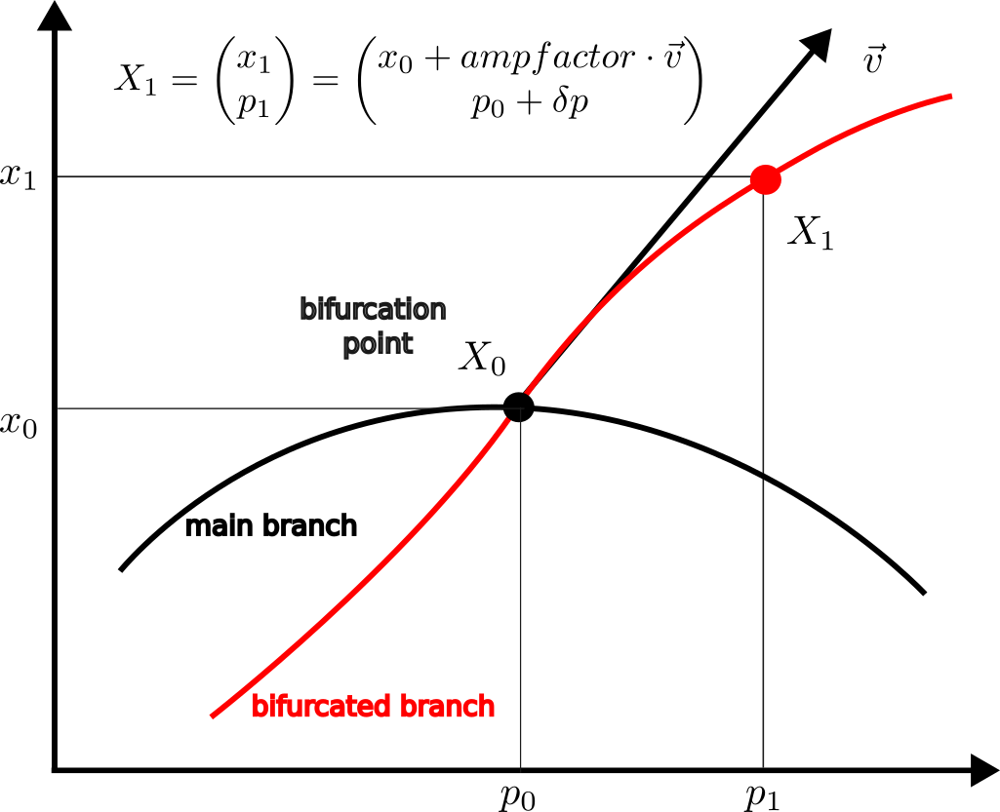

# [Branch switching](@id Branch-switching-page)

```@contents
Pages = ["intro-abs.md"]
Depth = 3
```

The precise definition of the methods is given in [Branch switching (branch point)](@ref) and [Branch switching (Hopf point)](@ref).

## (Automatic) branch switching of simple bifurcation points

Unlike other continuation softwares (Auto07p, MatCont, pde2path), `BifurcationKit` has methods for automatic branch switching where the user is only asked to provide the parameter distance from a point on the bifurcated branch to the bifurcation point. Let us explain this in more detail using the following figure.



Knowing a bifurcation point $X_0 = (x_0,p_0)$ on a branch `br`, we want to find the bifurcated (red) curve. To this, we need an initial guess $X_1$ on the bifurcated curve. Usually, the tangent $\vec v$ can be found which leaves two parameters `δp, ampfactor` to be determined. Note that both parameters needs to be small. For example, the default values are `δp = ds` (`ds` is in `ContinuationPar` ) and `ampfactor = 0.1`.

- In case of **manual branch switching**, the user is asked to provide the couple `δp, ampfactor`. This can be tricky because minute errors in `δp, ampfactor` can imped newton correction. This is for example used in [Lur'e problem](@ref pdlure) for period-doubling with Trapezoid method. Thus, the general method is like
```
continuation(br, ind_bif, options_cont; 
    δp = 0.1, ampfactor = 0.1,
    kwargs...)
```

- In case of **automatic branch switching**, the user is only asked to provide `δp` while `ampfactor` is internally estimated using the normal form of the bifurcation point. When the user does not pass `δp`, the value of `ds` is in `ContinuationPar` is used. Thus, the general method is like
```
continuation(br, ind_bif, options_cont; kwargs...)
```

When the bifurcation diagram is very stiff, **automatic branch switching** may fail (for example `BifurcationKit` could return `ampfactor=1e6` or `ampfactor = 1e-10`). In this case, one can override **automatic branch switching** and specify `δp, ampfactor` directly as for **manual branch switching** using

```
continuation(br, ind_bif, options_cont; 
    δp = 0.1, ampfactor = 0.1,
    override = true,
    kwargs...)
```

!!! tip "Manual branch switching"
    Manual branch switching is automatically used by `BifurcationKit` when the normal form of the bifurcation point is not implemented (like PD normal form for Trapezoid method). You can force `BifurcationKit` to use it using the `override` key word.

## Branch switching of non-simple bifurcation points

We refer to [Branch switching](@ref abs-nonsimple-eq) for more details.

## Graph of bifurcations

We provide a graph of bifurcations of equilibria and periodic orbits that can be detected in `BifurcationKit`. An arrow from say `Equilibrium` to `Hopf` means that Hopf bifurcations can be detected while continuing equilibria. Each object of codim 0 (resp. 1) can be continued in one (resp. 2) parameters.


## Summary of branching procedures

We collect in the following table the list of automatic branch switching (aBS) functions. Their detailed explanation follows in this page.

| function | ind-th bif. point | Type `T` | description |
|---|---|---|---|
|  `continuation(br::ContResult{T}, ind::Int; kw...)` | `:bp`, `:nd`| `EquilibriumCont`  |  aBS from equilibria to equilibria  |
|  `continuation(br::ContResult{T}, ind::Int, lens2::Lens; kw...)` | `:bp`, `:hopf`| `EquilibriumCont` | Fold/Hopf continuation w.r.t. parameters `getlens(br)` and `lens2`  |
|  `continuation(br::ContResult{T}, ind::Int; kw...)` | `:bt,:zh,:hh`| ` FoldCont,HopfCont` | switch to Fold/Hopf continuation from Hopf/Fold w.r.t. parameters of codim 2 `br`  |
| `continuation(br::ContResult{T}, ind_hopf::Int, ::ContinuationPar, prob::AbstractPeriodicOrbitProblem)`   | `:hopf` |  `EquilibriumCont` | Branch switching from Hopf point to periodic orbits |
| `continuation(br::ContResult{T}, ind::Int, kw...)`   | `:bp,:pd` |  `PeriodicOrbitCont` | Branch switching from Branch / Period-doubling point of periodic orbits to curve of periodic orbits |
| `continuation(br::ContResult{T}, ind::Int, kw...)`   | `:gh,:zh,:hh` |  `TwoParamCont` | Branch switching from Bautin / Zero-Hopf/ Hopf-Hopf point to curve of Fold/NS of periodic orbits |