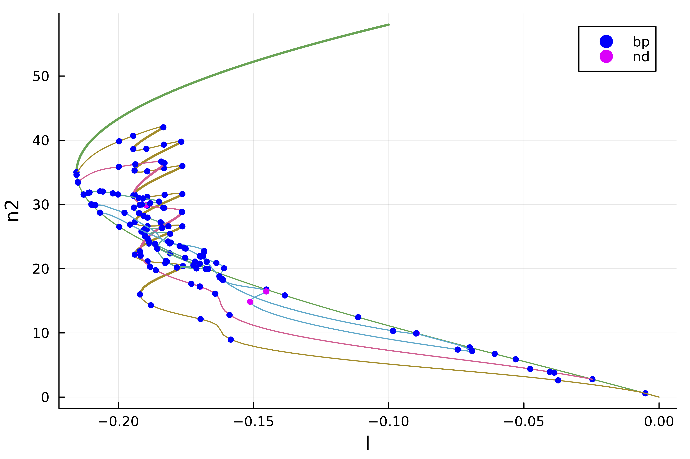

# [🟡 2d Swift-Hohenberg equation: snaking, Finite Differences](@id sh2dfd)

```@contents
Pages = ["tutorials2.md"]
Depth = 3
```

We study the following PDE

$$-(I+\Delta)^2 u+l\cdot u +\nu u^2-u^3 = 0$$

with Neumann boundary conditions. This full example is in the file `example/SH2d-fronts.jl`. This example is also treated in the MATLAB package [pde2path](http://www.staff.uni-oldenburg.de/hannes.uecker/pde2path/). We use a Sparse Matrix to express the operator $L_1=(I+\Delta)^2$.

```@example sh2dFD
using DiffEqOperators, Parameters
using BifurcationKit, Plots, SparseArrays
import LinearAlgebra: I, norm
const BK = BifurcationKit

# helper function to plot solution
heatmapsol(x) = heatmap(reshape(x,Nx,Ny)',color=:viridis)
heatmapsol!(x; k...) = heatmap!(reshape(x,Nx,Ny)';color=:viridis, k...)

Nx = 151
Ny = 100
lx = 4*2pi
ly = 2*2pi/sqrt(3)

# we use DiffEqOperators to compute the Laplacian operator
function Laplacian2D(Nx, Ny, lx, ly)
	hx = 2lx/Nx
	hy = 2ly/Ny
	D2x = CenteredDifference(2, 2, hx, Nx)
	D2y = CenteredDifference(2, 2, hy, Ny)
	Qx = Neumann0BC(hx)
	Qy = Neumann0BC(hy)

	A = kron(sparse(I, Ny, Ny), sparse(D2x * Qx)[1]) + kron(sparse(D2y * Qy)[1], sparse(I, Nx, Nx))
	return A, D2x
end
```

We also write the functional and its Jacobian which is a Sparse Matrix

```@example sh2dFD
function F_sh(u, p)
	@unpack l, ν, L1 = p
	return -L1 * u .+ (l .* u .+ ν .* u.^2 .- u.^3)
end

function dF_sh(u, p)
	@unpack l, ν, L1 = p
	return -L1 .+ spdiagm(0 => l .+ 2 .* ν .* u .- 3 .* u.^2)
end

# we compute the differentials
d2F_sh(u, p, dx1, dx2) = (2 .* p.ν .* dx2 .- 6 .* dx2 .* u) .* dx1
d3F_sh(u, p, dx1, dx2, dx3) = (-6 .* dx2 .* dx3) .* dx1
```

We first look for hexagonal patterns. This is done with

```@example sh2dFD
X = -lx .+ 2lx/(Nx) * collect(0:Nx-1)
Y = -ly .+ 2ly/(Ny) * collect(0:Ny-1)

# initial guess for hexagons
sol0 = [(cos(x) + cos(x/2) * cos(sqrt(3) * y/2) ) for x in X, y in Y]
sol0 .= sol0 .- minimum(vec(sol0))
sol0 ./= maximum(vec(sol0))
sol0 = sol0 .- 0.25
sol0 .*= 1.7

# define parameters for the PDE
Δ, _ = Laplacian2D(Nx, Ny, lx, ly);
L1 = (I + Δ)^2;
par = (l = -0.1, ν = 1.3, L1 = L1);

# Bifurcation Problem
prob = BifurcationProblem(F_sh, vec(sol0), par, (@lens _.l);
		J = dF_sh,
		plot_solution = (x, p; kwargs...) -> (heatmapsol!(x; label="", kwargs...)),
		record_from_solution = (x, p) -> (n2 = norm(x), n8 = norm(x, 8)),
		d2F = d2F_sh,
		d3F = d3F_sh)

# newton corrections of the initial guess
optnewton = NewtonPar(verbose = true, tol = 1e-8, max_iterations = 20)
sol_hexa = newton(prob, @set optnewton.verbose=false) # hide
sol_hexa = @time newton(prob, optnewton)
```

which produces the results

```julia
┌─────────────────────────────────────────────────────┐
│ Newton step         residual     linear iterations  │
├─────────────┬──────────────────────┬────────────────┤
│       0     │       1.7391e+02     │        0       │
│       1     │       5.0465e+03     │        1       │
│       2     │       1.4878e+03     │        1       │
│       3     │       4.3529e+02     │        1       │
│       4     │       1.2560e+02     │        1       │
│       5     │       3.5512e+01     │        1       │
│       6     │       9.5447e+00     │        1       │
│       7     │       2.1763e+00     │        1       │
│       8     │       3.3503e-01     │        1       │
│       9     │       7.7259e-02     │        1       │
│      10     │       7.4767e-03     │        1       │
│      11     │       7.9505e-05     │        1       │
│      12     │       8.8395e-09     │        1       │
└─────────────┴──────────────────────┴────────────────┘
  1.441525 seconds (1.74 k allocations: 659.488 MiB, 1.25% gc time)
```

with `sol_hexa` being

```@example sh2dFD
println("--> norm(sol) = ",norminf(sol_hexa.u))
heatmapsol(sol_hexa.u)
```

## Continuation and bifurcation points

We can now continue this solution as follows. We want to detect bifurcations along the branches. We thus need an eigensolver. However, if we use an iterative eigensolver, like `eig = EigArpack()`, it has trouble computing the eigenvalues. One can see that using

```julia
# compute the jacobian
J0 = dF_sh(sol_hexa.u, par)
```

The reason is that the jacobian operator is not very well conditioned unlike its inverse. We thus opt for the *shift-invert* method (see [Eigen solvers (Eig)](@ref) for more information) with shift `0.1`:

```julia
eig = EigArpack(0.1, :LM)

# compute 10 eigenvalues
eig(J0, 10)
```

If we want to compute the bifurcation points along the branches, we have to tell the solver by setting `detect_bifurcation = 2`. However, this won't be very precise and each bifurcation point will be located at best at the step size precision. We can use bisection to locate this points more precisely using the option `detect_bifurcation = 3` (see [Detection of bifurcation points of Equilibria](@ref) for more information).

We are now ready to compute the branches:

```julia
optcont = ContinuationPar(p_max = 0.0, p_min = -1.0,
	dsmin = 0.0001, dsmax = 0.005, ds= -0.001, 
	newton_options = setproperties(optnewton; tol = 1e-9),
	nev = 40)
optcont = @set optcont.newton_options.eigsolver = EigArpack(0.1, :LM)

br = continuation(
	re_make(prob, u0 = sol_hexa.u), PALC(), optcont;
	plot = true,
	normC = norminf)
```

Note that we can get some information about the branch as follows. The `[converged]` indicates if the bisection routine was successful, otherwise it shows `[guess]`. Finally `δ = ( 2,  0)` says that the bifurcation point has been detected by 2 new eigenvalues with zero real part among which zero have non zero imaginary part. A Hopf bifurcation point would thus have `δ = ( 2,  2)` or `δ = ( -2,  2)`.

```julia
julia> br
 ┌─ Curve type: EquilibriumCont
 ├─ Number of points: 98
 ├─ Type of vectors: Vector{Float64}
 ├─ Parameter l starts at -0.1, ends at 0.0
 ├─ Algo: PALC
 └─ Special points:

If `br` is the name of the branch,
ind_ev = index of the bifurcating eigenvalue e.g. `br.eig[idx].eigenvals[ind_ev]`

- #  1,       bp at l ≈ -0.21554729 ∈ (-0.21554729, -0.21554481), |δp|=2e-06, [converged], δ = ( 1,  0), step =  35, eigenelements in eig[ 36], ind_ev =   1
- #  2,       bp at l ≈ -0.21551019 ∈ (-0.21551494, -0.21551019), |δp|=5e-06, [converged], δ = ( 1,  0), step =  36, eigenelements in eig[ 37], ind_ev =   2
- #  3,       bp at l ≈ -0.21498022 ∈ (-0.21505410, -0.21498022), |δp|=7e-05, [converged], δ = ( 1,  0), step =  38, eigenelements in eig[ 39], ind_ev =   3
- #  4,       bp at l ≈ -0.21287212 ∈ (-0.21295316, -0.21287212), |δp|=8e-05, [converged], δ = ( 1,  0), step =  41, eigenelements in eig[ 42], ind_ev =   4
- #  5,       bp at l ≈ -0.20989694 ∈ (-0.21012690, -0.20989694), |δp|=2e-04, [converged], δ = ( 1,  0), step =  43, eigenelements in eig[ 44], ind_ev =   6
- #  6,       bp at l ≈ -0.20683673 ∈ (-0.20687197, -0.20683673), |δp|=4e-05, [converged], δ = ( 1,  0), step =  45, eigenelements in eig[ 46], ind_ev =   7
- #  7,       bp at l ≈ -0.20682087 ∈ (-0.20682308, -0.20682087), |δp|=2e-06, [converged], δ = ( 1,  0), step =  46, eigenelements in eig[ 47], ind_ev =   8
- #  8,       bp at l ≈ -0.19968465 ∈ (-0.20040489, -0.19968465), |δp|=7e-04, [converged], δ = ( 1,  0), step =  49, eigenelements in eig[ 50], ind_ev =   9
- #  9,       bp at l ≈ -0.18874190 ∈ (-0.18918387, -0.18874190), |δp|=4e-04, [converged], δ = ( 1,  0), step =  53, eigenelements in eig[ 54], ind_ev =  10
- # 10,       bp at l ≈ -0.18097123 ∈ (-0.18109194, -0.18097123), |δp|=1e-04, [converged], δ = ( 1,  0), step =  56, eigenelements in eig[ 57], ind_ev =  11
- # 11,       bp at l ≈ -0.14527574 ∈ (-0.14531247, -0.14527574), |δp|=4e-05, [converged], δ = (-1,  0), step =  65, eigenelements in eig[ 66], ind_ev =  11
- # 12,       bp at l ≈ -0.13844755 ∈ (-0.13874721, -0.13844755), |δp|=3e-04, [converged], δ = (-1,  0), step =  67, eigenelements in eig[ 68], ind_ev =  10
- # 13,       bp at l ≈ -0.11133440 ∈ (-0.11141358, -0.11133440), |δp|=8e-05, [converged], δ = (-1,  0), step =  73, eigenelements in eig[ 74], ind_ev =   9
- # 14,       nd at l ≈ -0.08965981 ∈ (-0.08982220, -0.08965981), |δp|=2e-04, [converged], δ = (-2,  0), step =  78, eigenelements in eig[ 79], ind_ev =   8
- # 15,       bp at l ≈ -0.07003255 ∈ (-0.07134810, -0.07003255), |δp|=1e-03, [converged], δ = (-1,  0), step =  82, eigenelements in eig[ 83], ind_ev =   6
- # 16,       bp at l ≈ -0.06080467 ∈ (-0.06212463, -0.06080467), |δp|=1e-03, [converged], δ = (-1,  0), step =  84, eigenelements in eig[ 85], ind_ev =   5
- # 17,       bp at l ≈ -0.05304226 ∈ (-0.05320751, -0.05304226), |δp|=2e-04, [converged], δ = (-1,  0), step =  86, eigenelements in eig[ 87], ind_ev =   4
- # 18,       bp at l ≈ -0.02465608 ∈ (-0.02531351, -0.02465608), |δp|=7e-04, [converged], δ = (-1,  0), step =  92, eigenelements in eig[ 93], ind_ev =   3
- # 19,       bp at l ≈ -0.00506953 ∈ (-0.00636490, -0.00506953), |δp|=1e-03, [converged], δ = (-1,  0), step =  96, eigenelements in eig[ 97], ind_ev =   2
- # 20, endpoint at l ≈ +0.00000000,
```

We get the following plot during computation:


!!! tip "Tip"
    We don't need to call `newton` first in order to use `continuation`.

## Snaking computed with deflation

We know that there is snaking near the left fold. Let us look for other solutions like fronts. The problem is that if the guess is not precise enough, the newton iterations will converge to the solution with hexagons `sol_hexa`. We appeal to the technique initiated by P. Farrell and use a **deflated problem** (see [`DeflationOperator`](@ref) and [`DeflatedProblem`](@ref) for more information). More precisely, we apply the newton iterations to the following functional $$u\to \Pi_{i=1}^{n_s}\left( \|u-sol_{hexa,i}\|^{-p} + \sigma\right)F_{sh}(u)$$
which penalizes `sol_hexa`.

```julia
# this define the above penalizing factor with p=2, sigma=1, norm associated to dot
# and the set of sol_{hexa} is of length ns=1
deflationOp = DeflationOperator(2, 1.0, [sol_hexa.u])
optnewton = @set optnewton.max_iterations = 250
outdef = newton(
				re_make(prob, u0 = 0.2vec(sol_hexa.u) .* vec([exp.(-(x+lx)^2/25) for x in X, y in Y])),
				deflationOp,
				optnewton, normN = norminf)
heatmapsol(outdef.u) |> display
BK.converged(outdef) && push!(deflationOp, outdef.u)
```
which gives:


Note that `push!(deflationOp, outdef)` deflates the newly found solution so that by repeating the process we find another one:

```julia
outdef = newton(
				re_make(prob, u0 = 0.2vec(sol_hexa.u) .* vec([exp.(-(x)^2/25) for x in X, y in Y])),
				deflationOp, optnewton, normN = norminf)
heatmapsol(outdef.u) |> display
BK.converged(outdef) && push!(deflationOp, outdef.u)
```


Again, repeating this from random guesses, we find several more solutions, like for example


We can now continue the solutions located in `deflationOp.roots`

```julia
br1 = @time continuation(re_make(prob, u0 = deflationOp[2]),
	PALC(), optcont;
	plot = true)
```

and using `plot(br, br1)`, we obtain:


Note that the plot provides the stability of solutions and bifurcation points. Interested readers should consult the associated file `example/SH2d-fronts.jl` in the `example` folder.

## Automatic branch switching

Instead of relying on deflated newton, we can use [Branch switching](https://bifurcationkit.github.io/BifurcationKitDocs.jl/dev/branchswitching/) to compute the different branches emanating from the bifurcation point. For example, the following code will perform automatic branch switching from the second bifurcation point of `br`:

```julia
br2 = continuation(br, 2, setproperties(optcont; ds = -0.001, detect_bifurcation = 3, plot_every_step = 5, max_steps = 170);  nev = 30,
	plot = true, verbosity = 2,
	normC = norminf)
```

We can then plot the branches using `plot(br, br2, br3)` and get


