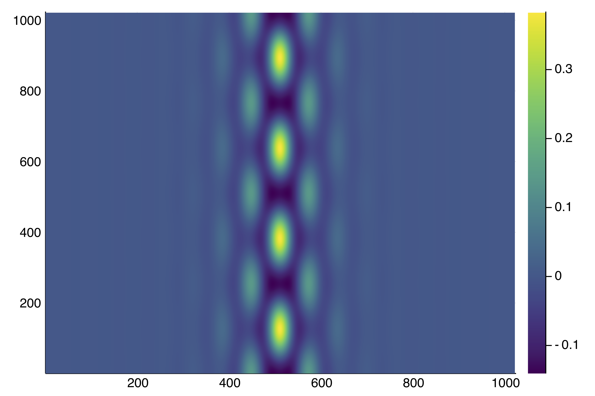
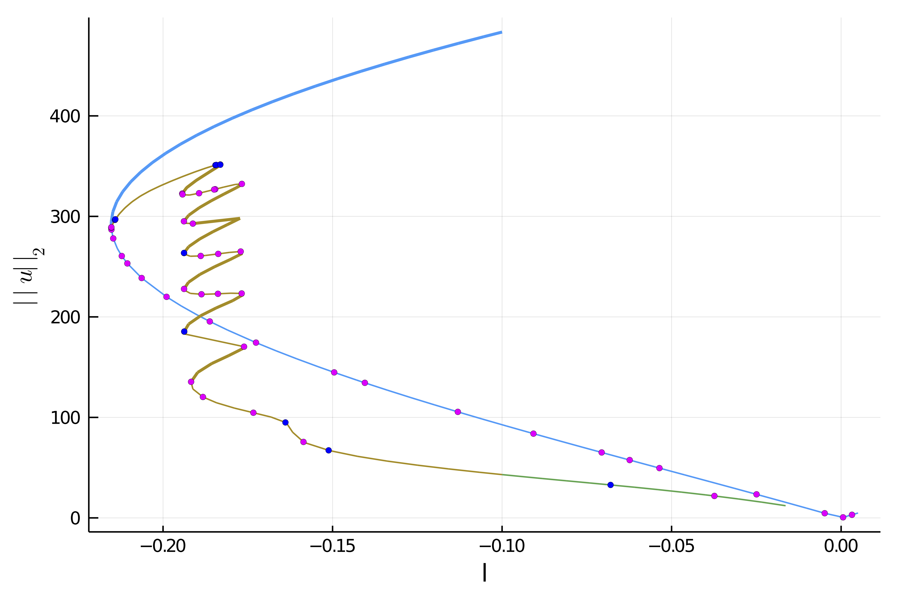

# [🟠 2d Swift-Hohenberg equation (non-local) on the GPU](@id sh2dgpu)

```@contents
Pages = ["tutorials2b.md"]
Depth = 3
```

Here we give an example where the continuation can be done **entirely** on the GPU, *e.g.* on a single V100 NIVDIA.


!!! info "Why this example?"
    This is not the simplest GPU example because we need a preconditioned linear solver and shift-invert eigen solver for this problem. On the other hand, you will be shown how to set up your own linear/eigen solver.

We choose the 2d Swift-Hohenberg as an example and consider a larger grid. See [2d Swift-Hohenberg equation](@ref sh2dfd) for more details. Solving the sparse linear problem in $v$

$$-(I+\Delta)^2 v+(l +2\nu u-3u^2)v = rhs$$

with a **direct** solver becomes prohibitive. Looking for an iterative method, the conditioning of the jacobian is not good enough to have fast convergence, mainly because of the Laplacian operator. However, the above problem is equivalent to:

$$-v + L \cdot (d \cdot v) = L\cdot rhs$$

where

$$L := ((I+\Delta)^2 + I)^{-1}$$

is very well conditioned and

$$d := l+1+2\nu v-3v^2.$$

Hence, to solve the previous equation, only a **few** GMRES iterations are required.

> In effect, the preconditioned PDE is an example of nonlocal problem.


## Linear Algebra on the GPU

We plan to use `KrylovKit` on the GPU. We define the following types so it is easier to switch to `Float32` for example:

```julia
using Revise, CUDA

# this disable slow operations but errors if you use one of them
CUDA.allowscalar(false)

# type used for the arrays, can be Float32 if GPU requires it
TY = Float64

# put the AF = Array{TY} instead to make the code on the CPU
AF = CuArray{TY}
```

## Computing the inverse of the differential operator
The issue now is to compute $L$ but this is easy using Fourier transforms.


Hence, that's why we slightly modify the previous Example by considering **periodic** boundary conditions. Let us now show how to compute $L$. Although the code looks quite technical, it is based on two facts. First, the Fourier transform symbol associated to $L$ is

$$l_1 = 1+(1-k_x^2-k_y^2)^2$$

which is pre-computed in the composite type `SHLinearOp `. Then, the effect of `L` on `u` is as simple as `real.(ifft( l1 .* fft(u) ))` and the inverse `L\u` is `real.(ifft( fft(u) ./ l1 ))`. However, in order to save memory on the GPU, we use inplace FFTs to reduce temporaries which explains the following code.

```julia
using AbstractFFTs, FFTW, KrylovKit
using BifurcationKit, LinearAlgebra, Plots
const BK = BifurcationKit
BK.set_plot_backend!(BK.BK_Plots()) # hide

# the following struct encodes the operator L1
# Making the linear operator a subtype of BK.AbstractLinearSolver is handy as it will be used
# in the Newton iterations.
struct SHLinearOp{Treal, Tcomp, Tl1, Tplan, Tiplan} <: BK.AbstractLinearSolver
	tmp_real::Treal         # temporary
	tmp_complex::Tcomp      # temporary
	l1::Tl1
	fftplan::Tplan
	ifftplan::Tiplan
end

# this is a constructor for the above struct
function SHLinearOp(Nx, lx, Ny, ly; AF = Array{TY})
	# AF is a type, it could be CuArray{TY} to run the following on GPU
	k1 = vcat(collect(0:Nx/2), collect(Nx/2+1:Nx-1) .- Nx)
	k2 = vcat(collect(0:Ny/2), collect(Ny/2+1:Ny-1) .- Ny)
	d2 = [(1-(pi/lx * kx)^2 - (pi/ly * ky)^2)^2 + 1. for kx in k1, ky in k2]
	tmpc = Complex.(AF(zeros(Nx, Ny)))
	return SHLinearOp(AF(zeros(Nx, Ny)), tmpc, AF(d2), plan_fft!(tmpc), plan_ifft!(tmpc))
end

import Base: *, \

# generic function to apply operator op to u
function apply(c::SHLinearOp, u, multiplier, op = *)
	c.tmp_complex .= Complex.(u)
	c.fftplan * c.tmp_complex
	c.tmp_complex .= op.(c.tmp_complex, multiplier)
	c.ifftplan * c.tmp_complex
	c.tmp_real .= real.(c.tmp_complex)
	return copy(c.tmp_real)
end

# action of L
*(c::SHLinearOp, u) = apply(c, u, c.l1)

# inverse of L
\(c::SHLinearOp, u) = apply(c, u, c.l1, /)
```

Before applying a Newton solver, we need to tell how to solve the linear equation arising in the Newton Algorithm.

```julia
# inverse of the jacobian of the PDE
function (sh::SHLinearOp)(J, rhs; shift = 0., tol =  1e-9)
	u, l, ν = J
	udiag = l .+ 1 .+ 2ν .* u .- 3 .* u.^2 .- shift
	res, info = KrylovKit.linsolve( du -> -du .+ sh \ (udiag .* du), sh \ rhs,
	tol, maxiter = 6)
	return res, true, info.numops
end
```

Now that we have our operator `L`, we can encode our functional:

```julia
function F_shfft(u, p)
	(;l, ν, L) = p
	return -(L * u) .+ ((l+1) .* u .+ ν .* u.^2 .- u.^3)
end
```


Let us now show how to build our operator `L` and an initial guess `sol0` using the above defined structures.

```julia
using LinearAlgebra, Plots

# to simplify plotting of the solution
plotsol(x; k...) = heatmap(reshape(Array(x), Nx, Ny)'; color=:viridis, k...)
plotsol!(x; k...) = heatmap!(reshape(Array(x), Nx, Ny)'; color=:viridis, k...)
norminf(x) = maximum(abs.(x))

# norm compatible with CUDA
norminf(x) = maximum(abs.(x))

Nx = 2^10
Ny = 2^10
lx = 8pi * 2
ly = 2*2pi/sqrt(3) * 2

X = -lx .+ 2lx/(Nx) * collect(0:Nx-1)
Y = -ly .+ 2ly/(Ny) * collect(0:Ny-1)

sol0 = [(cos(x) .+ cos(x/2) * cos(sqrt(3) * y/2) ) for x in X, y in Y]
sol0 .= sol0 .- minimum(vec(sol0))
sol0 ./= maximum(vec(sol0))
sol0 = sol0 .- 0.25
sol0 .*= 1.7

L = SHLinearOp(Nx, lx, Ny, ly; AF)
J_shfft(u, p) = (u, p.l, p.ν)

# parameters of the PDE
par = (l = -0.15, ν = 1.3, L = L)

# Bifurcation Problem
prob = BK.BifurcationProblem(F_shfft, AF(sol0), par, (@optic _.l) ;
	J = J_shfft,
	plot_solution = (x, p;kwargs...) -> plotsol!(x; color=:viridis, kwargs...),
	record_from_solution = (x, p; k...) -> norm(x))
```

## Newton iterations and deflation

We are now ready to perform Newton iterations:

```julia
opt_new = NewtonPar(verbose = true, tol = 1e-6, max_iterations = 100, linsolver = L)
sol_hexa = @time BK.solve(prob, Newton(), opt_new, normN = norminf)
println("--> norm(sol) = ", maximum(abs.(sol_hexa.u)))
plotsol(sol_hexa.u)
```

You should see this:

```julia
┌─────────────────────────────────────────────────────┐
│ Newton step         residual     linear iterations  │
├─────────────┬──────────────────────┬────────────────┤
│       0     │       3.3758e-01     │        0       │
│       1     │       8.0152e+01     │       12       │
│       2     │       2.3716e+01     │       28       │
│       3     │       6.7353e+00     │       22       │
│       4     │       1.9498e+00     │       17       │
│       5     │       5.5893e-01     │       14       │
│       6     │       1.0998e-01     │       12       │
│       7     │       1.1381e-02     │       11       │
│       8     │       1.6393e-04     │       11       │
│       9     │       7.3277e-08     │       10       │
└─────────────┴──────────────────────┴────────────────┘
  0.070565 seconds (127.18 k allocations: 3.261 MiB)
--> norm(sol) = 1.26017611779702
```

**Note that this is about the 30x faster than Example 2 but for a problem almost 100x larger! (On a V100 GPU)**

The solution is:


We can also use the deflation technique (see [`DeflationOperator`](@ref) and [`DeflatedProblem`](@ref) for more information) on the GPU as follows

```julia
deflationOp = DeflationOperator(2, dot, 1.0, [sol_hexa.u])

opt_new = @set opt_new.max_iterations = 250
outdef = @time BK.solve(re_make(prob, u0 = AF(0.4 .* sol_hexa.u .* AF([exp(-1(x+0lx)^2/25) for x in X, y in Y]))),
		deflationOp, opt_new, normN = x-> maximum(abs.(x)))
println("--> norm(sol) = ", norm(outdef.u))
plotsol(outdef.u) |> display
BK.converged(outdef) && push!(deflationOp, outdef.u)
```

and get:




## Computation of the branches

Finally, we can perform continuation of the branches on the GPU:

```julia
opts_cont = ContinuationPar(dsmin = 0.001, dsmax = 0.007, ds= -0.005,
	p_max = 0., p_min = -1.0, plot_every_step = 5, detect_bifurcation = 3,
	newton_options = setproperties(opt_new; tol = 1e-6, max_iterations = 15), max_steps = 100)

br = @time continuation(re_make(prob, u0 = deflationOp[1]),
PALC(bls = BorderingBLS(solver = L, check_precision = false)),
opts_cont;
	plot = true, verbosity = 3,
	normC = x -> maximum(abs.(x))
	)
```

We did not detail how to compute the eigenvalues on the GPU and detect the bifurcations. It is based on a simple Shift-Invert strategy, please look at `examples/SH2d-fronts-cuda.jl`.



We have the following information about the branch of hexagons

```julia
julia> br
┌─ Curve type: EquilibriumCont
 ├─ Number of points: 66
 ├─ Type of vectors: CuArray{Float64, 2, CUDA.DeviceMemory}
 ├─ Parameter l starts at -0.15, ends at 0.005
 ├─ Algo: PALC
 └─ Special points:

- #  1,       nd at l ≈ -0.21527227 ∈ (-0.21528429, -0.21527227), |δp|=1e-05, [   guessL], δ = ( 2,  0), step =  17
- #  2,       nd at l ≈ -0.21473544 ∈ (-0.21478790, -0.21473544), |δp|=5e-05, [   guessL], δ = ( 2,  0), step =  18
- #  3,       nd at l ≈ -0.21250580 ∈ (-0.21262132, -0.21250580), |δp|=1e-04, [   guessL], δ = ( 2,  0), step =  20
- #  4,       nd at l ≈ -0.21049751 ∈ (-0.21064704, -0.21049751), |δp|=1e-04, [    guess], δ = ( 2,  0), step =  21
- #  5,       nd at l ≈ -0.20955332 ∈ (-0.20971589, -0.20955332), |δp|=2e-04, [   guessL], δ = ( 4,  0), step =  22
- #  6,       bp at l ≈ -0.20586004 ∈ (-0.20606348, -0.20586004), |δp|=2e-04, [   guessL], δ = ( 1,  0), step =  24
- #  7,       nd at l ≈ -0.19890182 ∈ (-0.19915853, -0.19890182), |δp|=3e-04, [   guessL], δ = ( 2,  0), step =  26
- #  8,       nd at l ≈ -0.19864215 ∈ (-0.19890182, -0.19864215), |δp|=3e-04, [    guess], δ = ( 2,  0), step =  27
- #  9,       nd at l ≈ -0.18708961 ∈ (-0.18740461, -0.18708961), |δp|=3e-04, [   guessL], δ = ( 2,  0), step =  30
- # 10,       nd at l ≈ -0.17710705 ∈ (-0.17745465, -0.17710705), |δp|=3e-04, [   guessL], δ = ( 3,  0), step =  32
- # 11,       bp at l ≈ -0.17357172 ∈ (-0.17392941, -0.17357172), |δp|=4e-04, [   guessL], δ = ( 1,  0), step =  33
- # 12,       bp at l ≈ -0.15063090 ∈ (-0.15103338, -0.15063090), |δp|=4e-04, [   guessL], δ = (-1,  0), step =  37
- # 13,       nd at l ≈ -0.15022700 ∈ (-0.15063090, -0.15022700), |δp|=4e-04, [    guess], δ = (-3,  0), step =  38
- # 14,       nd at l ≈ -0.14079246 ∈ (-0.14120844, -0.14079246), |δp|=4e-04, [    guess], δ = (-2,  0), step =  40
- # 15,       nd at l ≈ -0.11282985 ∈ (-0.11327206, -0.11282985), |δp|=4e-04, [    guess], δ = (-4,  0), step =  45
- # 16,       nd at l ≈ -0.09040810 ∈ (-0.09086196, -0.09040810), |δp|=5e-04, [   guessL], δ = (-6,  0), step =  49
- # 17,       nd at l ≈ -0.07120307 ∈ (-0.07166296, -0.07120307), |δp|=5e-04, [   guessL], δ = (-3,  0), step =  52
- # 18,       nd at l ≈ -0.06198642 ∈ (-0.06244792, -0.06198642), |δp|=5e-04, [   guessL], δ = (-2,  0), step =  54
- # 19,       nd at l ≈ -0.05366990 ∈ (-0.05413224, -0.05366990), |δp|=5e-04, [   guessL], δ = (-2,  0), step =  56
- # 20,       nd at l ≈ -0.02503291 ∈ (-0.02549304, -0.02503291), |δp|=5e-04, [   guessL], δ = (-2,  0), step =  60
- # 21,       nd at l ≈ -0.00628734 ∈ (-0.00674105, -0.00628734), |δp|=5e-04, [    guess], δ = (-2,  0), step =  63
- # 22,       nd at l ≈ +0.00004100 ∈ (-0.00040962, +0.00004100), |δp|=5e-04, [   guessL], δ = ( 2,  0), step =  64
- # 23,       nd at l ≈ +0.00500000 ∈ (+0.00500000, +0.00500000), |δp|=0e+00, [    guess], δ = ( 9,  0), step =  65
- # 24, endpoint at l ≈ +0.00500000,                                                                     step =  65
```

## Automatic branch switching on the GPU

Instead of relying on deflated newton, we can use [Branch switching](https://bifurcationkit.github.io/BifurcationKitDocs.jl/dev/intro-abs/) to compute the different branches emanating from the bifurcation point. For example, the following code will perform automatic branch switching from the second bifurcation point of `br`:

```julia
br2 = continuation(br, 2, setproperties(optcont; ds = -0.001, detect_bifurcation = 3, plot_every_step = 5, max_steps = 170);  nev = 30,
	plot = true, verbosity = 2,
	normC = norminf)
```

We can then plot the branches using `plot(br, br1, br2)` and get


